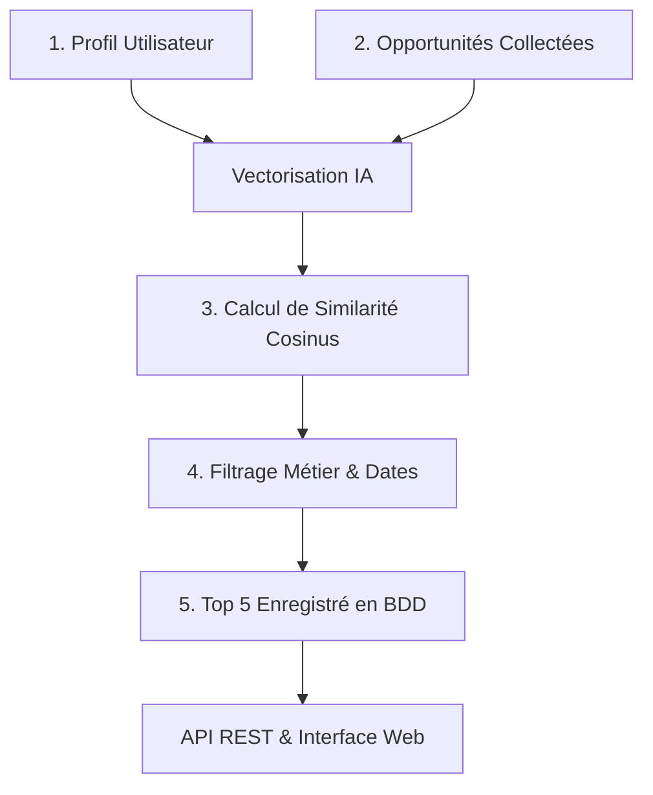

# 📑 RÉCAPITULATIF : MOTEUR DE MATCHING & RECOMMANDATION GAYNAAKO

**Date** : Septembre 2026  
**Projet** : Gaynaako Collector & Recommandation IA  
**Statut** : ✅ Opérationnel (100% IA Sémantique)

---

## 🎯 1. Objectif du Matching

Le système de recommandation a pour mission de connecter automatiquement et intelligemment :
* **D'un côté, les profils d'utilisateurs** enregistrés dans `gaynaako_profils` :
  * 👤 **ENTREPRENEUR** (domaine d'expertise, secteur, pays, objectifs)
  * 🏢 **PME** (nom d'entreprise, secteurs d'activité, localisation)
  * 🌍 **ONG** (nom d'organisation, domaines d'intervention, mission)
* **De l'autre côté, les opportunités d'affaires** collectées dans `gaynaako_opportunities` (appels d'offres, financements, subventions, formations).

Le système sélectionne pour chaque profil les **5 meilleures opportunités** dépassant un seuil de pertinence minimal de **55%**.

---

## 🧠 2. Modèles Utilisés

Le système repose sur des modèles de traitement du langage naturel (NLP) et d'embeddings neuronaux :

### A. Modèle Principal : `BAAI/bge-m3`
* **Type** : Modèle d'embeddings dense multilingue de pointe (1024 dimensions).
* **Rôle** : Compréhension sémantique profonde des textes complexes en français et anglais.
* **Point fort** : Capable de comprendre que *"santé animale"* et *"élevage de bétail"* traitent du même sujet même si les mots exacts diffèrent.

### B. Modèle Léger / Fallback : `sentence-transformers/paraphrase-multilingual-MiniLM-L12-v2`
* **Type** : Modèle multilingue compact (384 dimensions).
* **Rôle** : Assure une exécution rapide et légère en mémoire (CPU standard) si les ressources sont limitées ou hors-ligne.

### C. Formule de Scoring IA & Métier
Le score final combine la similarité vectorielle et les règles de validation métier :
$$\text{Score Final} = (\text{Similarité Cosinus IA} \times 0.70) + (\text{Bonus Secteur Métier} \times 0.30) + 0.10$$
* **Filtre éliminatoire** : Exclusion stricte des opportunités dont la date limite est expirée (`date_normalized < CURDATE()`).
* **Seuil d'éligibilité** : Seules les opportunités avec un score $\ge 55\%$ sont retenues.

---

## 🔄 3. Les 5 Étapes du Processus



### Étape 1 : Construction du texte contextuel
* **Profil** : Fusion des données du profil en une phrase représentative (rôle, secteurs, objectifs, compétences).
* **Opportunité** : Fusion du titre, des secteurs cibles, du pays et de la description.

### Étape 2 : Vectorisation neuronale (Embeddings)
* Le modèle IA convertit le profil et l'ensemble des opportunités valides en vecteurs numériques normalisés.

### Étape 3 : Mesure de similarité cosinus
* Calcul du produit scalaire entre le vecteur profil et chaque vecteur opportunité pour obtenir la proximité d'intention (entre 0 et 1).

### Étape 4 : Sélection du Top 5
* Application des filtres de date et du bonus de secteur.
* Tri par score décroissant et conservation des 5 meilleures recommandations $\ge 55\%$.

### Étape 5 : Persistance en Base de Données
* Remplacement automatique de l'ancien Top 5 de l'utilisateur dans la table `gaynaako_profils.recommandations` avec le label `IA_EMBEDDINGS`.

---

## 🗄️ 4. Architecture des Données

| Base de Données | Table | Description |
| :--- | :--- | :--- |
| `gaynaako_profils` | `utilisateurs`, `*_profiles` | Profils complets (Prisma Schema). |
| `gaynaako_profils` | `recommandations` | Table de stockage des Top 5 (`utilisateur_id`, `opportunite_id`, `score_pertinence`, `methode_matching = 'IA_EMBEDDINGS'`). |
| `gaynaako_opportunities` | `opportunities_processed` | Opportunités collectées, nettoyées et enrichies. |

---

## 🚀 5. Commandes & Utilisation

### Lancer le matching en ligne de commande :
* **Pour tous les profils** :
  ```powershell
  python bge-matching-mysql.py
  ```
* **Pour un utilisateur spécifique** :
  ```powershell
  python bge-matching-mysql.py usr-ent-001
  ```

### Exécuter le pipeline complet automatisé (Collecte ➔ NLP ➔ Embeddings ➔ Matching IA) :
```powershell
node pipeline-complet.js
```

### Consulter les recommandations via l'API REST (Port 3001) :
```http
GET http://localhost:3001/api/recommendations/usr-pme-001
```

### Tester via l'Interface Web interactive (Port 3000) :
```
http://localhost:3000
```
